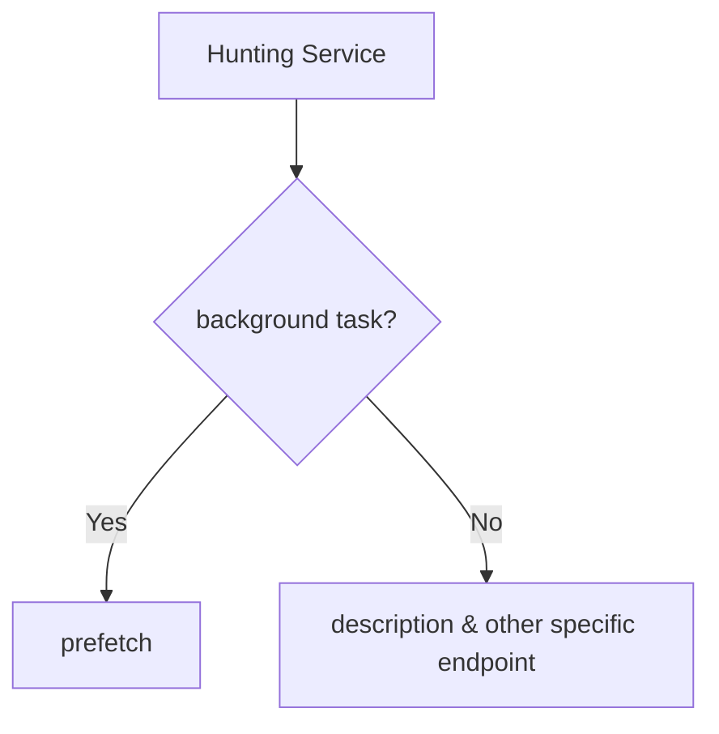
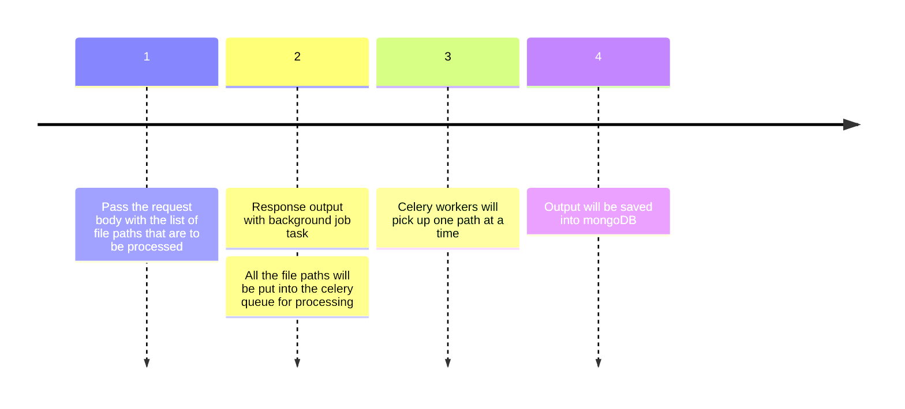

<details open>
<summary id = "table-of-content">Table of Contents</summary>

1. [Folder structure](#folder-structure)
2. [What?](#what)
3. [Why?](#why)
4. [Application](#application)
   1. [Starting application](#start-application)
   2. [Accessing application](#start-application)
   3. [Starting application](#start-application)
   4. [Stopping application](#stop-application)
   5. [Environment variables](#environment-variables)
5. [Which endpoint to choose?](#endpoint-selection)
6. [How does prefetch endpoint works?](#prefetch-description)
7. [How to check failed background tasks?](#prefetch-failed)

</details>

--- 

<h2 id = "folder-structure">Folder structure</h2>


```
.
├── Dockerfile                <- Dockerfile for production environment.
├── Dockerfile.dev            <- Dockerfile for development environment.
├── README.md                 <- Project documentation and information.
├── app
│   ├── __init__.py           <- Initialization for the 'app' package.
│   ├── api                   <- API route definitions and handlers.
│   ├── core                  <- Core application components and utilities.
│   ├── db                    <- Database configuration and management.
│   ├── main.py               <- Main FastAPI application entry point.
│   ├── models                <- Data models and database schemas.
│   ├── tests                 <- Unit and integration tests for the application.
│   ├── utils                 <- Utility functions and helper modules.
│   └── worker.py             <- Background task workers (if applicable).
├── docker-compose-dev.yml    <- Docker Compose configuration for development.
├── docker-compose.yml        <- Docker Compose configuration for production.
├── logs                      <- Log files generated by the application.
├── poetry.lock               <- Lock file for Python dependency management.
├── pyproject.toml            <- Project configuration and dependencies (Poetry).
├── scripts
    ├── codespaces-init.sh    <- Initialization script for Codespaces (if using VS Code Codespaces).
    └── gitpod-init.sh        <- Initialization script for Gitpod (if using Gitpod).

```

<div align="right"><a href= "#table-of-content">Table of Content</a></div>

---

<h2 id = "what">What</h2>

`hunting` service facilitates creation of dataset profiles i.e. details of dataset variable, correlation, numeric and categorical variables, missing values, etc as a fastAPI service.


---

<h2 id = "why">Why</h2>

Hunting servers the following purpose: 
- Automate the process of dataset profiling that could be for dataset description for [Dataful datasets page](https://dataful.in/datasets/1/). Hunting provides following attributes that are used for Dataset description page :
  - Number of Rows
  - Number of Columns
  - Data Preview
  - Metadata (column name, number of distinct values, number of unique values, type, count)

---

<h2 id = "application">Application</h2>

<h4 id = "start-application">Start Application</h4>

- Execute the following command docker-compose command to start the entire NEDC Database application and the dependent services

  ```
    docker-compose up
  ```

- When the application is started using docker-compose, a directory with name `volumes` will be created in the directory where all the docker data for all the services will be persisted.

<h4 id = "access-application">Access Application</h4>

Once the application is up and running you should be able to access it using the following urls:

| Service | URL |
|--|--|
| Server | API Root: http://0.0.0.0:8000/api/v1 <br> Swagger: http://0.0.0.0:8000/api/docs <br> Redoc: http://0.0.0.0:8000/redoc|
| MongoDB | http://localhost:27017 <br> Username: root <br> Password: example <br>|
| Redis | http://localhost:6379 <br> Password: password|
| Flower | Dashboard: http://localhost:5555|


<h4 id = "stop-application">Stopping Application</h4>

- Execute the following command docker-compose command to stop Dega and all the components

  ```
    docker-compose stop
  ```

Or use the following command to stop the application, and remove all the containers and networks that were created:

  ```
    docker-compose down
  ```

<h4 id = "environment-variables">Environment Variables</h4>

- Create `.env` file in the root directory based on `.env.example`. 
    - The values in `.env.example` are pre-configured to running the application using the default `docker-compose.yml`
- If no `.env` file is found in the root directory, the default values provided in `/app/core/config.py` will be considered for the environment variables.
    - The values in `/app/core/config.py` are pre-configured to running the application using the default `docker-compose.yml`

---


<h3 id = "endpoint-selection">Which Endpoint to Choose?</h3>

There are 2 types of endpoint that could be used for dataset profiling:



Below table provide the detailed explanation for the above classification:

|prefetch|description|
|:-:|:-:|
|Post request that takes a list of s3 file path for datasets|Get Request that takes 1 file path of dataset|
|Puts the Datasets into the Celery queue and process them as background job|Process the datasets on the fly|
|Output is saved into mongoDB for each file path|Pandas profiling output is returned as JSON output|

---

<h3 id = "prefetch-description">How does Prefetch Endpoint works?</h3>

Following process happens in sequence for prefetch endpoint:



NOTE:
- Prefetch group of routes will only be enabled if ENABLE_PREFETCH is true.

---

<h3 id = "prefetch-failed">How to check Failed background tasks?</h3>

Use `flower` to check the status for the background tasks. With every prefetch request, a `trigger_id` is passed. That is helpful to check the status of the background task.

- Example of request made to `prefetch`:
```json
{
    "urls": [
        "s3://roapitest/titanic.csv"
    ],
    "minimal": true,
    "samples_to_fetch": 10,
    "trigger_id": "dd6d2667-366c-4ca5-a403-b227cc2148ff"
}
```

- Example fo response from `prefetch`:
```json
{
  "task_id": "ff8dfbc7-b383-43cd-a0e9-6af7d1226205",
  "trigger_id": "dd6d2667-366c-4ca5-a403-b227cc2148ff"
}
```

Open the Flower `task` option and in the search bar pass the trigger_id. It will show only tasks that are related to that trigger_id. Click on the `state` to sort on status for the task for each file.
